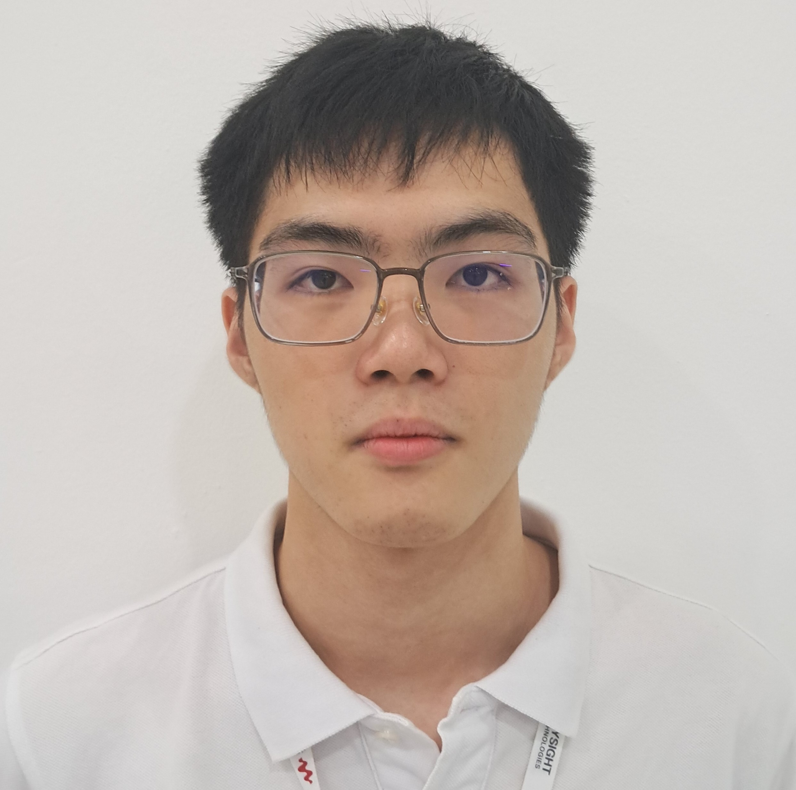

# Introduction
Hi! I'm Seah Eu Jin, a student in the Software Maintenance
and Evolution course.
I expect to learn a lot about modern software maintenance
practices and how to work with legacy systems.
- **Fun fact**: I like to read novel during my free time.
- **Course expectations**: To Understand the whole process and learn about the Software Maintenance
and Evolution course.
 <!-- Link to the uploaded image -->
## GitHub Profile
You can view my personalized GitHub profile
[here](https://github.com/Seah-Eu-Jin).
